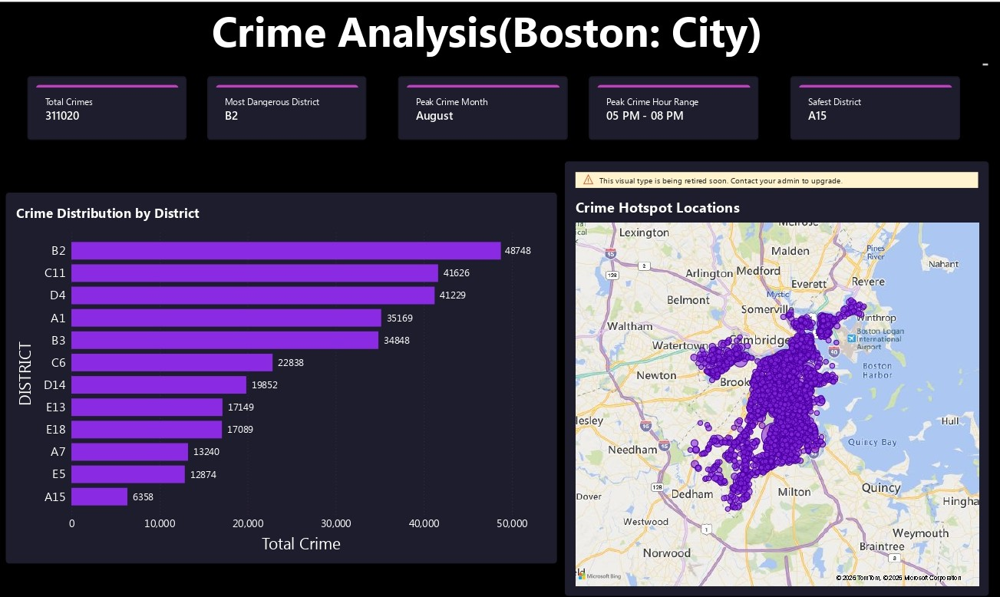
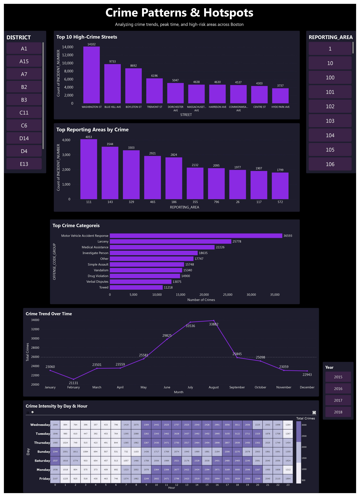
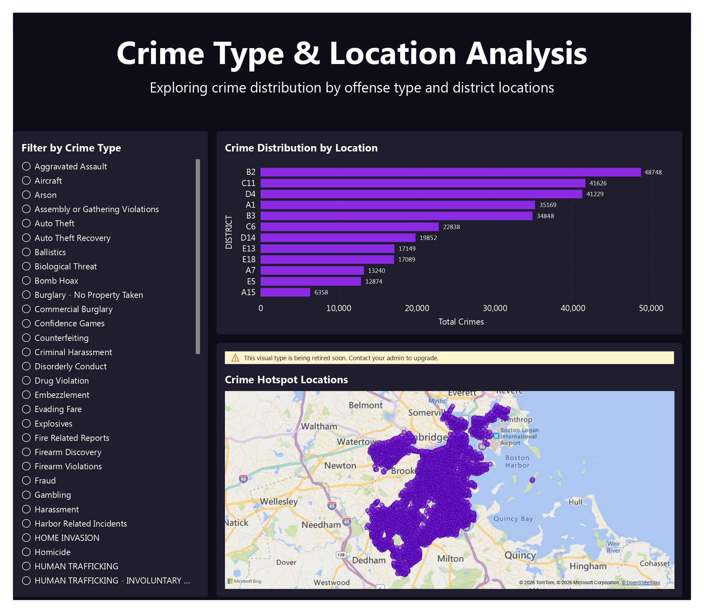

# 📊 Boston Crime Data Analysis & Interactive Dashboard

## 📌 Project Overview
This project presents an end-to-end data analysis of Boston city crime data to uncover patterns, identify high-risk locations, and analyze time-based crime trends. The project demonstrates strong data analytics skills including data cleaning, exploratory data analysis, and interactive dashboard development using Python and Power BI.

The objective is to transform raw crime data into meaningful insights and build a professional dashboard to support data-driven decision-making.

---

## 🎯 Key Objectives
- Analyze crime distribution across districts and locations
- Identify peak crime hours, months, and patterns
- Determine most frequent crime categories
- Detect high-crime streets and reporting areas
- Build an interactive and insight-driven Power BI dashboard

---

## 🛠 Tools & Technologies Used
- Python (Pandas, NumPy, Matplotlib)
- Jupyter Notebook
- Power BI
- Data Cleaning & Transformation
- Data Visualization & Dashboarding

---

## 📂 Project Structure
- `Crime_Data_Analysis.ipynb` → Data cleaning and exploratory data analysis using Python  
- `Boston_Crime_Analysis_Dashboard.pbix` → Interactive Power BI dashboard  
- `Dashboard_Overview.jpg` → Overview dashboard preview  
- `Crime_Patterns.jpg` → Crime patterns and hotspot analysis  
- `Crime_Type_Analysis.jpg` → Crime type and location insights  

**Note:** The dataset used in this project is large and cannot be uploaded to GitHub due to size limitations. All analysis steps and dashboard visuals are included for review.

---

## 📊 Key Insights Generated
- Identified districts with highest and lowest crime rates  
- Analyzed peak crime hours and peak months  
- Discovered top crime categories and high-crime streets  
- Time-series analysis of crime trends  
- Location-based crime distribution and hotspot detection  

---

## 📸 Dashboard Preview

### 🔹 Overview Dashboard

### 🔹 Crime Patterns & Hotspots

### 🔹 Crime Type & Location Analysis

---

## 🚀 Skills Demonstrated
- Data Cleaning & Preprocessing  
- Exploratory Data Analysis (EDA)  
- Data Visualization  
- Dashboard Development  
- Business Insight Generation  
